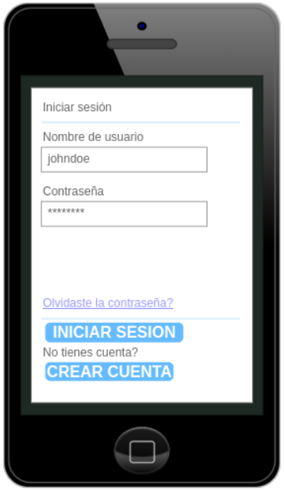
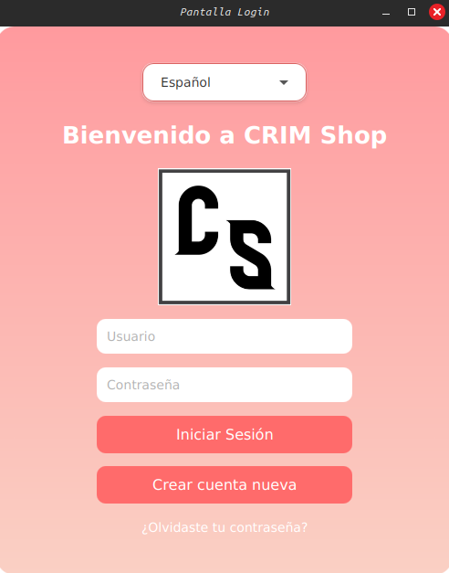

# CRIM Shop – Tu estilo, nuestra pasión


Bienvenidos al repositorio oficial de **CRIM Shop**, la tienda online desarrollada con mimo y esfuerzo por dos personas que comparten una visión: ofrecer productos únicos con atención al detalle y una experiencia de compra inigualable.

---

## ¿Qué es CRIM Shop?

**CRIM Shop** es una aplicación de tienda online que permite a los usuarios descubrir y adquirir ropa seleccionada con un enfoque personal y de calidad. Nuestra misión es transformar cada compra en una experiencia especial, gracias a un diseño atractivo, procesos optimizados y una atención cercana al cliente.

Este proyecto está pensado para todas aquellas personas que buscan ropa única y quieren sentirse parte de una comunidad. Además, la app ofrece un sistema de gestión para que los trabajadores puedan administrar pedidos, productos y devoluciones de forma eficiente.

Lo que hace especial a CRIM Shop es su enfoque **humano y personal** tanto en lo visual como en la experiencia del usuario. Cada cliente es parte de nuestra historia, y cada detalle está diseñado con ese valor en mente.

---

## Diseño

### Prototipo inicial (Figma)

  
*Primer wireframe en Figma, centrado en la navegación básica y estructura general.*

### Diseño implementado

  
*Diseño final con colores corporativos, tipografía definida y funciones completas integradas.*


---

## Tecnologías usadas

- Java
- JavaFX
- SQLite3
- CSS
- Maven

---

## Instrucciones de instalación

1. Clona este repositorio:
   ```bash
   git clone https://github.com/PRORIX/CRIM-Shop-repository
   ```

2. Accede a la carpeta del proyecto:
   ```bash
   cd CRIM-Shop-repository
   ```

3. Ejecuta la aplicación con Maven:
   ```bash
   mvn javafx:run
   ```

> Asegúrate de tener Java y Maven correctamente instalados en tu sistema.

---

## Roles y actores en la aplicación

### Usuario

Los usuarios son los actores comunes que usan la APP. No tienen permisos especiales y pueden realizar compras, para lo cual necesitarán tener una cuenta creada.

### Gestor

Los gestores son trabajadores de la tienda online con permisos limitados. Son los encargados de preparar y gestionar los pedidos para su envío. Tienen acceso exclusivo a la sección de gestión de pedidos.

### Administrador

Los administradores son trabajadores con permisos completos. Cuentan con una cuenta tipo ADMIN que les permite gestionar productos, pedidos, reembolsos, usuarios, inventario y más.

### Sistema de pago

Pasarela de pago integrada para facilitar las compras de los usuarios con total seguridad.

---

## Tabla de características

| Funcionalidad                  | Estado |
|-------------------------------|--------|
| Registro/Login                | ✅     |
| Visualización de productos    | ❌     |
| Carrito de compras            | ❌     |
| Gestión de pedidos            | ❌     |
| Gestión de inventario (Admin) | ❌     |
| Reembolsos                    | ❌     |
| Pasarela de pago              | ❌     |

---

## Roadmap – Próximas mejoras

- [ ] Notificaciones por email para pedidos
- [ ] Sistema de valoraciones y reseñas
- [ ] Dark mode

---

## Demo

[Ver demo ]()  

---

## Contribuciones

¿Te gustaría aportar al proyecto? ¡Estaremos encantados de recibir sugerencias, feedback o pull requests!  
Puedes abrir un *Issue* o enviar directamente una *Pull Request*.

---

**CRIM Shop** – Hecho con ilusión y código por personas reales.
